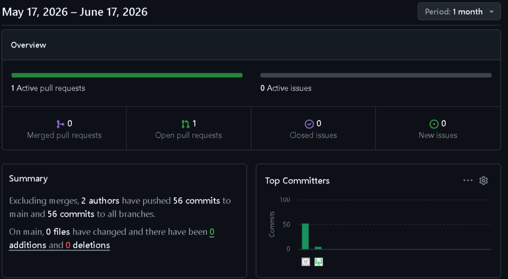
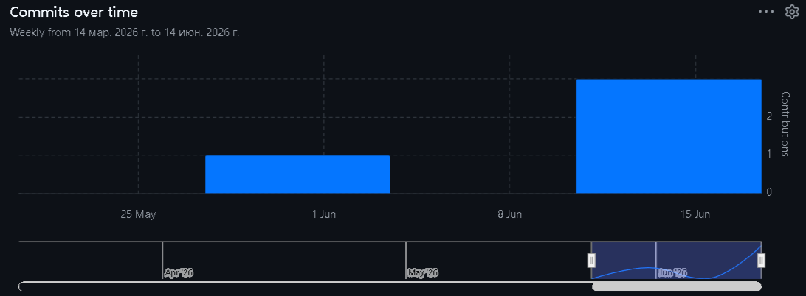

# 🏆 Resume-Web — Банк резюме IT-команд

**Resume-Web** — это платформа для поиска и публикации IT-команд. Капитаны создают профили своих команд, указывают стек технологий, а работодатели или заинтересованные разработчики могут просматривать команды, оставлять real-time комментарии и добавлять их в избранное.

Проект разработан в рамках курсовой работы по дисциплине «Технология разработки программного обеспечения» (**траектория В: React SPA + AJAX + JWT + WebSocket**).

---

## 🚀 Технологический стек

### Backend
| Технология | Назначение |
|:---|:---|
| **Django 5** | Веб-фреймворк |
| **Django REST Framework (DRF)** | Создание REST API |
| **Simple JWT** | JWT-аутентификация (access/refresh токены) |
| **Django Channels** | WebSocket для real-time комментариев |
| **Daphne** | ASGI-сервер для поддержки WebSocket |
| **SQLite** | База данных (разработка) |
| **django-cors-headers** | Настройка CORS |
| **django-filter** | Фильтрация запросов |

### Frontend
| Технология | Назначение |
|:---|:---|
| **React 18** | Библиотека для построения интерфейсов |
| **React Router** | Маршрутизация |
| **Axios** | HTTP-клиент (перехватчики для JWT) |
| **TanStack React Query** | Кэширование и управление состоянием запросов |
| **CSS-in-JS** | Стилизация компонентов |

---

## 📋 Основной функционал

### Публичная часть (доступна всем)
*   Просмотр списка IT-команд (с пагинацией)
*   Поиск команд по названию
*   Фильтрация команд по стеку технологий
*   Регистрация и аутентификация (JWT)
*   Просмотр детальной страницы команды

### Приватная часть (для авторизованных пользователей)
| Роль | Возможности |
|:---|:---|
| **Капитан команды** | Создание, редактирование, удаление своей команды, управление статусом публикации, получение real-time комментариев |
| **Пользователь** | Добавление команд в избранное, просмотр избранного в личном кабинете, написание комментариев к командам в реальном времени |
| **Администратор** | Полный доступ к управлению через админ-панель Django |

### Real-time функционал (WebSocket)
*   💬 **Комментарии** — новые комментарии появляются у всех пользователей, просматривающих команду, без перезагрузки страницы

### Дополнительный функционал
*   **Система избранного** — пользователи могут сохранять команды и просматривать их в личном кабинете
*   **Поиск и фильтрация** — поиск по названию команды и фильтр по стеку технологий
*   **Пагинация** — на главной странице выводится по 10 команд
*   **Управление командой** — капитан может редактировать данные и снимать команду с публикации

---

## 🧱 Структура репозитория

### Backend (`/backend`)
```bash
backend/
├── config/                 # Настройки проекта (settings.py, urls.py, asgi.py)
├── teams/                  # Приложение команд и комментариев
│   ├── models.py           # Модели Team, TechStack, Comment, Favorite
│   ├── serializers.py      # Сериализаторы для API
│   ├── views.py            # ViewSet'ы (API эндпоинты)
│   ├── consumers.py        # WebSocket consumer для комментариев
│   └── urls.py             # Маршруты API
├── users/                  # Приложение пользователей и аутентификации
│   ├── models.py           # Расширенная модель User
│   ├── serializers.py      # Сериализаторы для регистрации и профиля
│   ├── views.py            # View для регистрации и профиля
│   └── urls.py             # Маршруты аутентификации
├── manage.py
├── requirements.txt
└── db.sqlite3
```
Frontend (/frontend)
```bash
frontend/
├── public/
│   └── index.html
├── src/
│   ├── components/         # Переиспользуемые компоненты (Login, Toast)
│   ├── pages/              # Страницы приложения
│   │   ├── LandingPage.js  # Стартовая страница
│   │   ├── TeamList.js     # Главная страница со списком команд
│   │   ├── TeamDetail.js   # Детальная страница команды (с комментариями)
│   │   ├── CreateTeam.js   # Создание команды
│   │   ├── EditTeam.js     # Редактирование команды
│   │   └── Profile.js      # Личный кабинет (с вкладками "Мои команды" и "Избранное")
│   ├── contexts/           # Контексты приложения
│   │   ├── AuthContext.js  # Управление JWT-токенами и состоянием авторизации
│   │   └── NotificationContext.js # Система уведомлений
│   ├── hooks/              # Кастомные хуки
│   │   └── useTeamsQuery.js# Хуки для работы с API (React Query)
│   ├── App.js
│   ├── index.js
│   └── index.css
├── .env
├── package.json
└── README.md
```
Установка и запуск
Требования
Python 3.11+
Node.js 18+
npm

1. Клонирование репозитория
```bash
git clone https://github.com/LeoGoldov/course-project.git
cd course-project
```
2. Настройка бэкенда
```bash
cd backend
python -m venv venv

# Активация окружения (Windows)
venv\Scripts\activate
# Для macOS/Linux: source venv/bin/activate

pip install -r requirements.txt
python manage.py migrate
python manage.py createsuperuser

# Для работы WebSocket (рекомендуется)
pip install daphne
daphne -b 127.0.0.1 -p 8000 config.asgi:application
# Альтернатива (без WebSocket): python manage.py runserver
```
3. Настройка фронтенда
```bash
cd ../frontend
npm install
npm start
```
4. Открыть в браузере
Фронтенд: http://localhost:3000
Админка Django: http://127.0.0.1:8000/admin
API (browsable): http://127.0.0.1:8000/api/teams/

👥 API-эндпоинты (основные)
```bash
Аутентификация (/api/auth/)
Метод	Эндпоинт	Описание	Доступ
POST	/api/auth/register/	Регистрация	Все
POST	/api/auth/login/	Получение JWT (access/refresh)	Все
POST	/api/auth/token/refresh/	Обновление access-токена	Все
GET/PATCH	/api/auth/profile/	Профиль пользователя	Авторизованные
Команды и избранное (/api/)
Метод	Эндпоинт	Описание	Доступ
GET	/api/teams/	Список команд (с пагинацией, поиском, фильтром)	Все
POST	/api/teams/	Создание команды	Авторизованные
GET	/api/teams/{id}/	Детали команды	Все
PATCH	/api/teams/{id}/	Обновление команды	Капитан
DELETE	/api/teams/{id}/	Удаление команды	Капитан
POST	/api/teams/{id}/increment_views/	Увеличение счётчика просмотров	Все
GET	/api/teams/my_teams/	Список своих команд	Авторизованные
GET/POST	/api/favorites/	Список/добавление в избранное	Авторизованные
DELETE	/api/favorites/{id}/	Удаление из избранного	Авторизованные
Комментарии (/api/comments/)
Метод	Эндпоинт	Описание	Доступ
GET	/api/comments/?team={id}	Получить комментарии команды	Все
POST	/api/comments/	Создать комментарий	Авторизованные
Веб-сокеты
URL	Описание
ws://localhost:8000/ws/teams/{team_id}/	WebSocket-канал для real-time комментариев к команде
```
💼 Бизнес-логика

ГОСТЬ (неавторизованный)

Просматривает список опубликованных команд

Ищет команды по названию

Фильтрует команды по стеку технологий

Видит детальную информацию о команде

АВТОРИЗОВАННЫЙ ПОЛЬЗОВАТЕЛЬ
Всё, что может гость

Создаёт собственную команду (становится её капитаном)

Редактирует и удаляет свою команду

Добавляет любые команды в избранное

Оставляет real-time комментарии к командам

КАПИТАН КОМАНДЫ

Всё, что может авторизованный пользователь

Управляет статусом публикации своей команды

Получает обратную связь через комментарии

АДМИНИСТРАТОР

Управляет всеми командами и пользователями через админ-панель Django

📊 Статистика разработки

Всего коммитов: 59

Период разработки: март – июнь 2026

Средняя частота: ~2 коммита/день


График активности



Тепловая карта



Автор

Студент: Жерлицын Лев Вячеславович

Группа: ПИЖ-б-о-24-1

Направление: 09.03.04 «Программная инженерия»

Профиль: «Разработка и сопровождение программного обеспечения»
